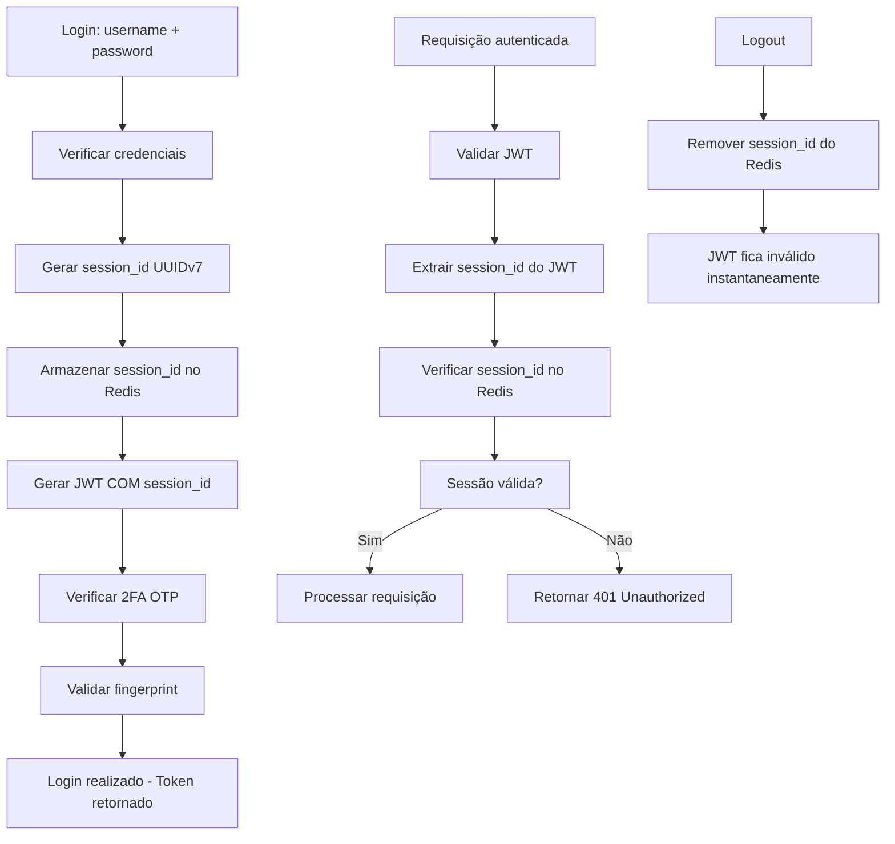
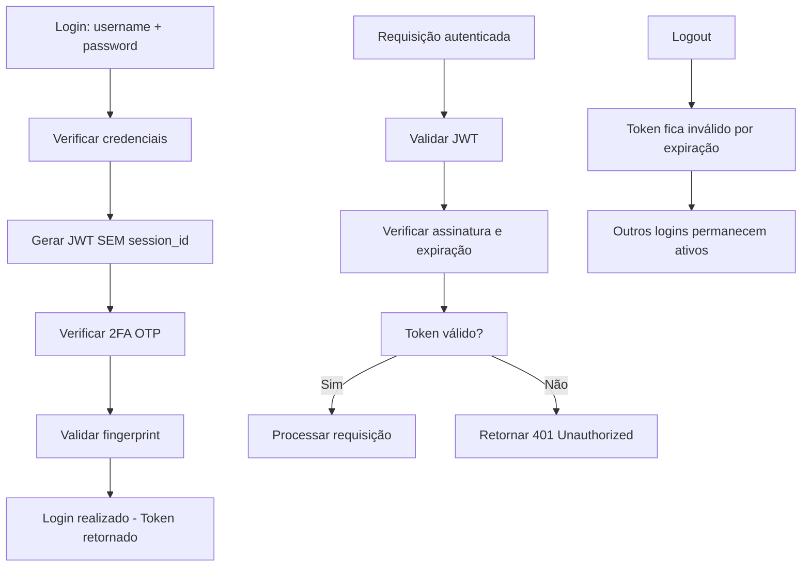
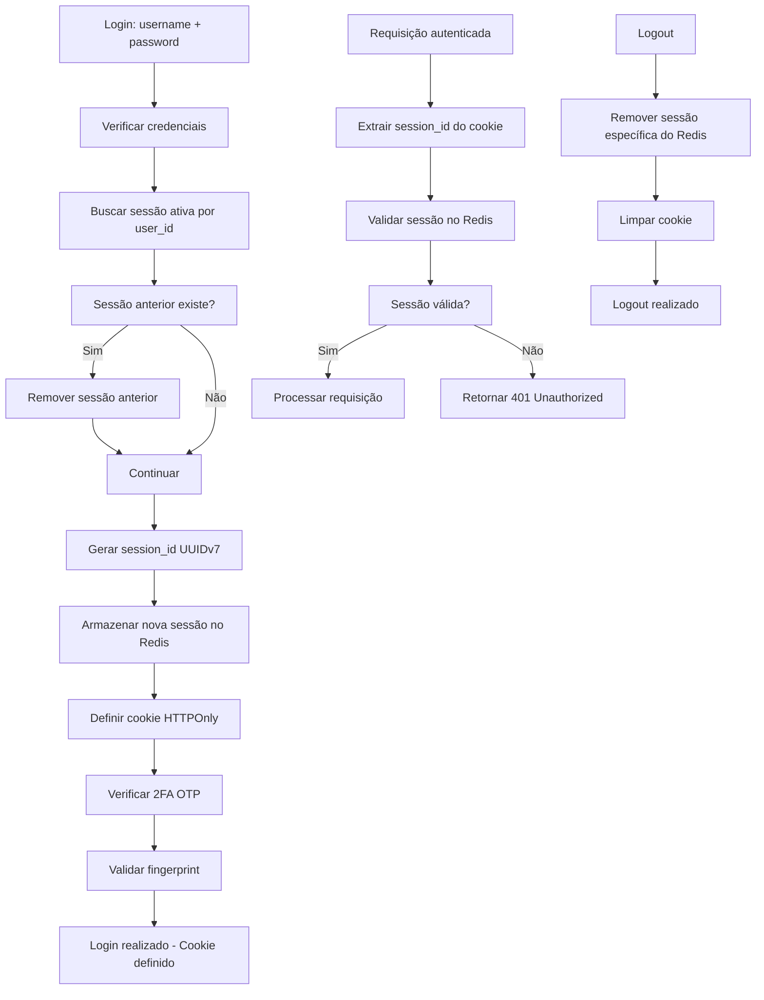
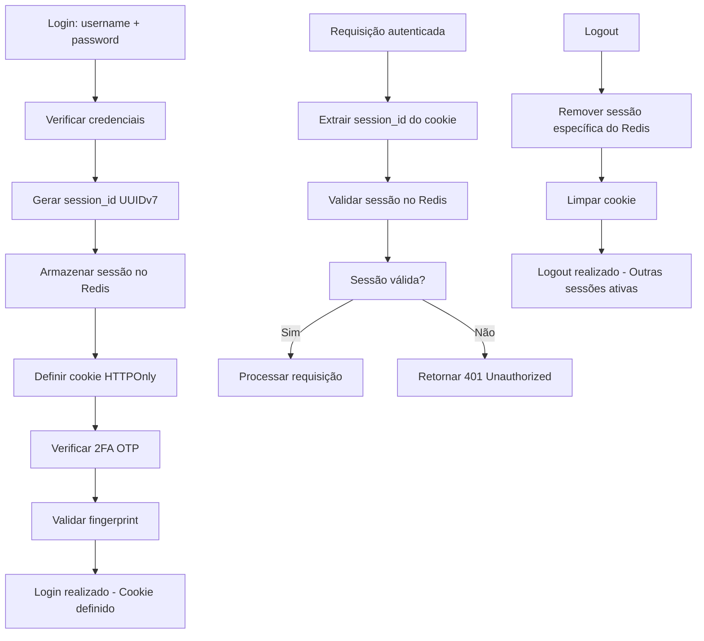

# BP-Fast - Sistema de Autenticação Híbrido Avançado

Um sistema de autenticação robusto e inteligente construído com FastAPI, Vue.js e Redis, implementando um **sistema híbrido** que combina JWT com invalidação centralizada e sessões Redis para máxima flexibilidade e segurança.

## 🎯 Objetivo

Este projeto serve como um template completo para sistemas de autenticação que implementam:

- **Sistema híbrido JWT + Sessões Redis** com configuração dinâmica
- **Login único vs múltiplo** configurável por usuário
- **JWT com session_id** para invalidação centralizada
- **Sessões Redis** para múltiplos logins simultâneos
- **Autenticação de dois fatores (2FA) com OTP**
- **Sistema de fingerprint para detecção de dispositivos**
- **Recuperação de senha via email**
- **Verificação de email para ativação de conta**
- **Monitoramento com OpenTelemetry**

## 🏗️ Arquitetura

### Backend (FastAPI + Python)
```
backend/
├── src/
│   ├── adapters/          # Implementações concretas
│   ├── core/              # Lógica de negócio
│   ├── infra/             # Infraestrutura
│   │   ├── connect/       # Conexões (DB, Redis)
│   │   ├── model/         # Modelos SQLAlchemy
│   │   ├── security/      # Módulos de segurança
│   │   │   ├── auth/      # Sistema híbrido JWT/Sessões
│   │   │   ├── hashpass/  # Hash de senhas (bcrypt)
│   │   │   └── otp/       # Autenticação 2FA
│   │   └── security/
│   ├── interfaces/        # Controllers e Schemas
│   └── utils/             # Utilitários
├── tests/                 # Testes automatizados
└── otel/                  # Configuração OpenTelemetry
```

### Frontend (Vue.js)
```
frontend/
├── src/
│   ├── components/        # Componentes Vue
│   ├── services/          # API Services
│   └── assets/           # Recursos estáticos
└── public/               # Arquivos públicos
```

## 🔐 Recursos de Segurança Avançados

### 1. Sistema Híbrido JWT + Sessões Redis Flexível

**Configuração dinâmica** que permite alternar entre métodos de autenticação e modos de login:

```python
# Configuração no .env
APP_AUTH_METHOD=JWT        # ou COOKIE
APP_LOGIN_MODE=UNIQUE      # ou MULTIPLE
```

**JWT Flexível:**
- **Login Único**: JWT contém `session_id` → invalida login anterior
- **Login Múltiplo**: JWT sem `session_id` → permite múltiplos logins
- **Invalidação centralizada** via Redis quando necessário
- **Logout instantâneo** sem esperar expiração do token

**Sessões Redis Flexíveis:**
- **Login Único**: Valida por `user_id` → invalida sessão anterior
- **Login Múltiplo**: Sem validação de sessão ativa → permite múltiplas sessões
- **Cookies HTTPOnly** para session IDs
- **TTL configurável** por sessão
- **Gerenciamento granular** de dispositivos

### 2. Modos de Login Configuráveis

**JWT - Login Único (UNIQUE):**
```python
# Estrutura JWT COM session_id (invalida login anterior)
{
    "user_id": "123",
    "session_id": "uuid-v7-session-id",
    "exp": timestamp,
    "iat": timestamp
}
```

**JWT - Login Múltiplo (MULTIPLE):**
```python
# Estrutura JWT SEM session_id (permite múltiplos logins)
{
    "user_id": "123",
    "exp": timestamp,
    "iat": timestamp
}
```

**Sessões Redis - Login Único (UNIQUE):**
```python
# Validação por user_id (invalida sessão anterior)
# Busca: user_session:{user_id} → remove sessão ativa
# Cria: nova sessão para o usuário
```

**Sessões Redis - Login Múltiplo (MULTIPLE):**
```python
# Sem validação de sessão ativa (permite múltiplas sessões)
# Cria: nova sessão sem verificar sessões existentes
# Estrutura da sessão:
{
    "user_id": "123",
    "username": "usuario",
    "login_time": "2024-01-01T10:00:00Z",
    "device_info": "desktop_chrome_1920x1080",
    "fingerprint": "device_hash"
}
```

### 3. Sistema de Invalidação Inteligente

**JWT - Login Único:**
- Token contém `session_id` único
- Validação verifica se `session_id` existe no Redis
- Logout remove `session_id` do Redis
- Token fica inválido instantaneamente

**JWT - Login Múltiplo:**
- Token sem `session_id` nos claims
- Validação apenas da assinatura e expiração
- Logout não afeta outros logins ativos
- Tokens independentes por dispositivo

**Sessões Redis - Login Único:**
- Busca sessão ativa por `user_id`
- Remove sessão anterior antes de criar nova
- Mapeamento: `user_session:{user_id} → session_id`
- Invalidação automática de login anterior

**Sessões Redis - Login Múltiplo:**
- Sem verificação de sessões ativas
- Cria nova sessão independentemente
- Múltiplas sessões simultâneas por usuário
- Invalidação individual por `session_id`

### 4. Autenticação de Dois Fatores (2FA)
- **TOTP com pyotp**: Códigos de 6 dígitos válidos por 30 segundos
- **QR Code**: Geração automática para Google Authenticator/Authy
- **Secret Base32**: Armazenamento seguro do secret no banco
- **Configurável por usuário**: 2FA opcional ou obrigatório

### 5. Sistema de Fingerprint Avançado
- **Detecção de dispositivo**: Coleta informações do navegador/dispositivo
- **Notificações inteligentes**: Alerta quando fingerprint não é reconhecido
- **Suporte desktop/mobile**: Adaptação automática ao tipo de dispositivo
- **Machine Learning**: Análise de padrões suspeitos (futuro)

### 6. Hash de Senhas Robusto
- **bcrypt**: Algoritmo seguro com salt automático
- **Validação de força**: Senhas devem atender critérios rigorosos
- **Verificação segura**: Comparação sem exposição da senha
- **Configuração flexível**: Critérios ajustáveis por ambiente

### 7. Recuperação de Senha Segura
- **Token temporário**: Link seguro com expiração configurável
- **Email de recuperação**: Processo via email com validação
- **Reset seguro**: Nova senha com validação de força
- **Rate limiting**: Proteção contra ataques de força bruta

### 8. Verificação de Email Completa
- **Ativação de conta**: Email obrigatório para ativar conta
- **Validação de entrega**: Verificação se email é válido e entregável
- **Token de ativação**: Link seguro para ativação
- **Templates personalizáveis**: HTML responsivo para emails

## 🚀 Tecnologias

### Backend
- **FastAPI**: Framework web moderno e rápido
- **SQLAlchemy**: ORM com suporte assíncrono
- **PostgreSQL**: Banco de dados principal
- **Redis**: Cache e gerenciamento de sessões
- **JWT**: Tokens de autenticação com invalidação centralizada
- **bcrypt**: Hash de senhas
- **pyotp**: Geração e validação de OTP
- **Alembic**: Sistema de migrações de banco de dados
- **OpenTelemetry**: Observabilidade (traces, logs, métricas)

### Frontend
- **Vue.js 3**: Framework reativo
- **Vite**: Build tool moderno
- **Axios**: Cliente HTTP
- **Tailwind CSS**: Framework CSS (recomendado)

### DevOps & Observabilidade
- **Docker Compose**: Orquestração de serviços
- **Grafana**: Dashboards de monitoramento
- **Prometheus**: Coleta de métricas
- **Loki**: Agregação de logs
- **Tempo**: Rastreamento distribuído

## 📋 Fluxos de Autenticação

### Fluxo JWT - Login Único (UNIQUE)



### Fluxo JWT - Login Múltiplo (MULTIPLE)



### Fluxo Sessões Redis - Login Único (UNIQUE)



### Fluxo Sessões Redis - Login Múltiplo (MULTIPLE)



## 🛠️ Instalação e Configuração

### Pré-requisitos
- Python 3.12+
- Node.js 18+
- Docker e Docker Compose
- PostgreSQL 15+
- Redis 6+

### 1. Clone o repositório
```bash
git clone <repository-url>
cd bp-fast
```

### 2. Configuração do Backend
```bash
cd backend

# Copie o arquivo de exemplo
cp env.example .env

# Edite as configurações
nano .env
```

**Configurações importantes no `.env`:**
```env
# Database Configuration
postgres_drivername=postgresql+psycopg2
postgres_db_user=user
postgres_db_password=secure_password
postgres_db_host=localhost
postgres_db_port=5432
postgres_db_name=bp_fast_db

# Redis Configuration
redis_host=localhost
redis_port=6379
redis_db=0
redis_ttl=3600

# JWT Configuration
jwt_secret=your-super-secret-key-here
jwt_algorithm=HS256
jwt_expiration_time=3600

# App Configuration
app_name=bp-fast
app_version=0.1.0
APP_AUTH_METHOD=JWT          # JWT ou COOKIE
APP_LOGIN_MODE=UNIQUE        # UNIQUE ou MULTIPLE

# TOTP Configuration
totp_interval=30
totp_digits=6
totp_window=1
```

### 3. Instalação das dependências
```bash
# Backend
cd backend
uv sync

# Frontend
cd ../frontend
pnpm install
```

### 4. Executar com Docker Compose
```bash
# Na raiz do projeto
docker compose up -d
```

### 5. Executar migrações com Alembic
```bash
cd backend

# Gerar nova migração (quando houver mudanças nos modelos)
alembic revision --autogenerate -m "Descrição da mudança"

# Aplicar migrações pendentes
alembic upgrade head

# Ver histórico de migrações
alembic history

# Voltar para uma versão específica (se necessário)
alembic downgrade -1
```

### 6. Iniciar aplicação
```bash
# Backend
cd backend
uvicorn src:app --reload

# Frontend (em outro terminal)
cd frontend
pnpm dev
```

## 📊 Monitoramento

O projeto inclui configuração completa do OpenTelemetry com:

- **Grafana**: Dashboards para métricas e logs
- **Prometheus**: Coleta de métricas da aplicação
- **Loki**: Agregação e consulta de logs
- **Tempo**: Rastreamento distribuído de requisições

### Acessar dashboards:
- Grafana: http://localhost:3000
- Prometheus: http://localhost:9090
- Loki: http://localhost:3100

## 🧪 Testes

```bash
# Executar todos os testes
cd backend
pytest --cov -vv

# Executar testes específicos
pytest tests/test_auth.py -v

# Gerar relatório de cobertura
coverage html

# Verificar cobertura no terminal
coverage report
```

## 📈 Progresso do Projeto

Veja o arquivo [TODO.md](./TODO.md) para acompanhar o progresso de desenvolvimento e próximas funcionalidades.

## 📚 API Endpoints

### Autenticação
- `POST /api/auth/signup` - Registro de usuário
- `POST /api/auth/signin` - Login (JWT ou Sessão)
- `POST /api/auth/logout` - Logout (invalidação centralizada)
- `POST /api/auth/verify-email` - Verificação de email
- `POST /api/auth/reset-password` - Solicitar reset de senha
- `POST /api/auth/confirm-reset` - Confirmar reset de senha

### 2FA
- `POST /api/auth/otp/setup` - Configurar 2FA
- `POST /api/auth/otp/verify` - Verificar código OTP
- `GET /api/auth/otp/qr` - Obter QR Code para 2FA

### Fingerprint
- `POST /api/auth/fingerprint/register` - Registrar fingerprint
- `POST /api/auth/fingerprint/verify` - Verificar fingerprint

### Usuário
- `GET /api/user/profile` - Perfil do usuário
- `PUT /api/user/profile` - Atualizar perfil
- `POST /api/user/change-password` - Alterar senha
- `GET /api/user/sessions` - Listar sessões ativas (modo múltiplo)

## 🔒 Considerações de Segurança

### Implementadas
- ✅ Hash de senhas com bcrypt
- ✅ Sistema híbrido JWT + Sessões Redis
- ✅ Login único vs múltiplo configurável
- ✅ Invalidação centralizada de tokens
- ✅ Cookies HTTPOnly para sessões
- ✅ Validação de entrada rigorosa
- ✅ Headers de segurança
- ✅ CORS configurado
- ✅ Logs de segurança
- ✅ Operações atômicas com Lua scripts

### Recomendações Adicionais
- Implementar rate limiting
- Adicionar captcha para tentativas de login
- Configurar HTTPS em produção
- Implementar logging de auditoria
- Adicionar headers de segurança (HSTS, CSP)
- Configurar backup automático do Redis
- Implementar refresh token para sessões longas
- Adicionar detecção de anomalias

## 📝 Estrutura do Banco de Dados

### Tabela `users`
```sql
CREATE TABLE users (
    id SERIAL PRIMARY KEY,
    name VARCHAR(64) NOT NULL,
    surname VARCHAR(64) NOT NULL,
    email VARCHAR(64) UNIQUE NOT NULL,
    phone VARCHAR(15),
    username VARCHAR(64) UNIQUE NOT NULL,
    password VARCHAR(128) NOT NULL,
    logged_in BOOLEAN DEFAULT FALSE,
    secret_otp VARCHAR(128),
    otp_enabled BOOLEAN DEFAULT FALSE,
    allowed BOOLEAN DEFAULT TRUE,
    attempts INTEGER DEFAULT 0,
    blocked BOOLEAN DEFAULT FALSE,
    last_login TIMESTAMP,
    created_at TIMESTAMP DEFAULT NOW(),
    updated_at TIMESTAMP DEFAULT NOW()
);
```

### Tabela `fingerprints`
```sql
CREATE TABLE fingerprints (
    id SERIAL PRIMARY KEY,
    user_id INTEGER REFERENCES users(id),
    fingerprint VARCHAR(255) NOT NULL,
    device_type VARCHAR(50),
    allowed BOOLEAN DEFAULT TRUE,
    created_at TIMESTAMP DEFAULT NOW(),
    updated_at TIMESTAMP DEFAULT NOW()
);
```

## 🔄 Vantagens do Sistema Híbrido Flexível

### JWT Flexível

**Login Único (COM session_id):**
- **Invalidação instantânea**: Logout imediato sem esperar expiração
- **Controle centralizado**: Session ID gerenciado no Redis
- **Segurança aprimorada**: Token invalidadado via Redis
- **Auditoria completa**: Rastreamento de sessão única

**Login Múltiplo (SEM session_id):**
- **Múltiplos dispositivos**: Usuário pode estar logado em vários dispositivos
- **Performance otimizada**: Validação apenas de assinatura e expiração
- **Independência**: Tokens não afetam uns aos outros
- **Escalabilidade**: Sem dependência do Redis para validação

### Sessões Redis Flexíveis

**Login Único (com validação por user_id):**
- **Controle granular**: Invalidação automática de login anterior
- **Mapeamento inteligente**: `user_session:{user_id} → session_id`
- **Operações atômicas**: Lua scripts garantem consistência
- **Auditoria detalhada**: Histórico de sessões por usuário

**Login Múltiplo (sem validação de sessão ativa):**
- **Flexibilidade máxima**: Múltiplas sessões simultâneas
- **Experiência do usuário**: Não precisa fazer logout de outros dispositivos
- **Controle individual**: Gerenciamento por session_id específico
- **TTL independente**: Diferentes tempos de vida por sessão

### Características Técnicas Avançadas
- **UUIDv7**: Identificadores únicos com timestamp incorporado
- **Lua Scripts**: Operações atômicas garantem consistência
- **Cookies HTTPOnly**: Prevenção de ataques XSS
- **TTL Configurável**: Tempo de vida das sessões ajustável
- **Mapeamento Inteligente**: Busca otimizada por usuário ou sessão
- **Configuração Dinâmica**: Alternância entre métodos e modos sem restart
- **Validação Condicional**: Comportamento adaptado ao modo de login

## 🎛️ Configurações Avançadas

### Modos de Autenticação

**JWT com Session ID (Login Único):**
```env
APP_AUTH_METHOD=JWT
APP_LOGIN_MODE=UNIQUE
```

**JWT sem Session ID (Login Múltiplo):**
```env
APP_AUTH_METHOD=JWT
APP_LOGIN_MODE=MULTIPLE
```

**Sessões Redis (Login Único):**
```env
APP_AUTH_METHOD=COOKIE
APP_LOGIN_MODE=UNIQUE
```

**Sessões Redis (Login Múltiplo):**
```env
APP_AUTH_METHOD=COOKIE
APP_LOGIN_MODE=MULTIPLE
```

### Configurações de Segurança

**TOTP:**
```env
totp_interval=30        # Intervalo em segundos
totp_digits=6          # Número de dígitos
totp_window=1          # Janela de tolerância
```

**Redis:**
```env
redis_ttl=3600         # TTL padrão em segundos
redis_host=localhost   # Host do Redis
redis_port=6379        # Porta do Redis
```

## 🤝 Contribuição

1. Fork o projeto
2. Crie uma branch para sua feature (`git checkout -b feature/AmazingFeature`)
3. Commit suas mudanças (`git commit -m 'Add some AmazingFeature'`)
4. Push para a branch (`git push origin feature/AmazingFeature`)
5. Abra um Pull Request

## 📄 Licença

Este projeto está sob a licença MIT. Veja o arquivo `LICENSE` para mais detalhes.

## 🆘 Suporte

Para dúvidas ou problemas:
1. Verifique a documentação
2. Procure nas issues existentes
3. Crie uma nova issue com detalhes do problema

---

**Desenvolvido com ❤️ para segurança, flexibilidade e performance**